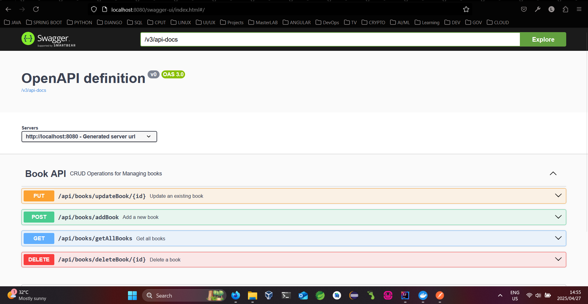

# 📚 Catalogue Management

A multi-tier Spring Boot application for managing a book catalogue. It allows book collectors to create, update, view, and delete books in their personal library.

---

## 🚀 Project Overview

This solution is split into two Spring Boot services:

- **Management Service**: Exposes a REST API to manage books.
- **Web UI Service** (optional, if you're planning): Connects via JAX-RS Client and renders a web interface.

This repository contains the **Management Service** and Docker support.

---

## 🛠️ Tech Stack

- Java 17
- Spring Boot 3
- Maven
- H2 In-Memory Database
- Docker
- Swagger API Documentation 

---

## 📦 Features

- 📖 List all books
- ➕ Add new books
- 📝 Update existing books
- ❌ Delete books
- 📄 Swagger UI for API exploration

---

## ⚙️ How to Run

### 🐳 Docker (Recommended)

1. **Create the Docker network for both services:**
   ```bash
   docker network create catalogue-network

2. **Build the Docker image:**
   ```bash
   docker build -t catalogue-management .

3. **Run the Docker image inside the network:**
   ```bash
   docker run -d --name cataloguemanagement --network catalogue-network -p 8080:8080 catalogue-management

### 🧪 Running Locally (without Docker)

1. **Build the project to produce the jar :**
   ```bash
      mvn clean package
   
2. **Run the application:**
   ```bash
      java -jar target/CatalogueManagement-0.0.1-SNAPSHOT.jar

### Running with Maven
1. **Clone the repository**
   ```bash
   git clone https://github.com/liyabonasaki/CatalogueManagement.git
   cd CatalogueManagement

2. **Build and run the project**
   ```bash
   mvn spring-boot:run

## Accessing the API using Swagger
Open your browser and go to http://localhost:8080/swagger-ui/index.html#/

